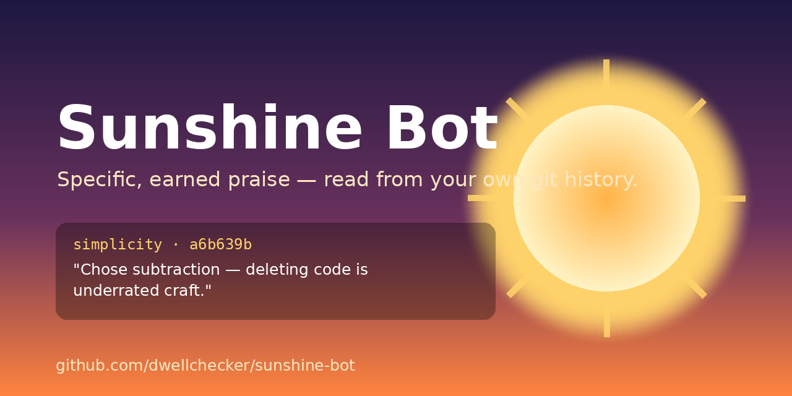

# ☀️ Sunshine Bot



   

**A configurable positivity engine that reads your own git history and shares specific, earned praise to keep the team motivated.**

Your team's day is full of negative signal by design: QA reports list defects, bug trackers are a queue of problems, customer complaints are loud, and sprints compress. The good work — the clean API, the deleted complexity, the copy that finally clicks — goes unremarked. Sunshine Bot is the deliberate counterweight. It scans the same repository the team pours its work into, finds genuinely good commits, and says so out loud, **with receipts**.

```
  ☀  Sunshine — 2026-06-13

  🪶  simplicity
     Marco chose subtraction in e8ef649: "remove dead code in legacy module". Deleting code is underrated craft.

  🔌  API design
     Nina designed a cleaner contract in a6b639b (#41): "redesign the users endpoint schema". Good API design is invisible until you need it.

  🛡️  safety
     Marco kept users safe in dd72159: "validate and sanitize all user input". The bugs you prevent never make the changelog, but they matter most.
```

## The one rule

**Every compliment cites a concrete artifact** — a commit, a file, a PR. If there's no artifact, there's no compliment. "Great job team!" is impossible by construction. When a window has no qualifying work, Sunshine Bot says the week was quiet rather than inventing praise.

## Quick start

```bash
# Preview against the current repo — writes nothing, posts nothing
npx sunshine-bot preview

# Create a config you can customize
npx sunshine-bot init

# Run for real: updates SUNSHINE.md (and any channels you've enabled)
npx sunshine-bot run
```

Requires Node 18+. Zero runtime dependencies.

## How it works

```
collect git signal  →  classify into categories  →  select exemplars  →  generate  →  deliver
```

1. **Collect** commits in a window derived from your cadence (`daily`=1d, `weekly`=7d, `monthly`=30d) or an explicit `--since`.
2. **Classify** each commit against every enabled praise category, scoring keyword hits in the message, path/extension matches in the changed files, and diff shape (e.g. net code removal reads as *simplicity*).
3. **Select** the single strongest, distinct commit per category — recognition spreads across the team rather than piling on one commit.
4. **Generate** a tone-aware compliment that names the real artifact and author.
5. **Deliver** to the channels you've turned on.

## Praise categories

Fully configurable. The default taxonomy:

`marketing-copy` · `api-design` · `ux` · `visual-design` · `simplicity` · `progressive-disclosure` · `safety` · `performance` · `docs` · `test-coverage` · `accessibility`

Each has keyword and file-path signals. Enable, disable, or weight any of them in config.

## Configuration

Everything is optional — `sunshine-bot` works with zero config. To customize, run `sunshine init` and edit `sunshine.config.json`:

| Field | Default | What it does |
|---|---|---|
| `cadence` | `"weekly"` | `daily` \| `weekly` \| `monthly` — sets the default lookback window. |
| `tone` | `"warm"` | `subtle` \| `warm` \| `effusive` — how loud the praise is. |
| `categories` | all on | `{ "category": true \| false \| weight }`. Weight scales a category's score during selection. |
| `channels` | stdout + markdown | Where compliments go (see below). |
| `minConfidence` | `1` | Minimum match score for a compliment to be emitted. Higher = pickier. |
| `team` | `{}` | Map a git author name/email to a display handle, e.g. `"Nina Patel": "@nina"`. |
| `optOut` | bots | Authors to never single out. |
| `intro` | `""` | An optional line shown before the praise — good for acknowledging a hard sprint. |
| `quietFallback` | (honest note) | Shown when a run finds no qualifying work. |

Invalid config fails loudly, naming the exact field.

### Channels

| Channel | Default | Notes |
|---|---|---|
| `stdout` | **on** | Colored terminal summary. Always safe. |
| `markdown` | **on** | Maintains `SUNSHINE.md`, a growing dated log of wins (newest first). |
| `slack` | off | Posts to an incoming webhook. The URL comes only from the env var named by `webhookEnv` (default `SLACK_WEBHOOK_URL`) — **never** from config. |
| `github` | off | Posts a PR comment using `GITHUB_TOKEN` in a GitHub Actions context. |

**Safe by default:** outbound posting is off until you enable it. A fresh install cannot spam a channel, and secrets only ever come from environment variables.

Example: enable Slack.

```json
{
  "channels": {
    "slack": { "enabled": true, "webhookEnv": "SLACK_WEBHOOK_URL" }
  }
}
```

```bash
export SLACK_WEBHOOK_URL="https://hooks.slack.com/services/…"
npx sunshine-bot run
```

Here's how the weekly digest lands in a channel ([interactive mock](marketing/slack-preview.html), [raw payload](assets/slack-blocks.example.json)):

| | |
|---|---|
| **☀️ Sunshine — Mon** | _Tough sprint, real progress._ |
| 🪶 | Marco chose subtraction in `e8ef649`: deleting code is underrated craft. |
| 🔌 | Nina designed a cleaner contract in #41: good API design is invisible until you need it. |
| 🛡️ | Marco kept users safe in `dd72159`: the bugs you prevent never make the changelog. |

**Setup:** in Slack, create an [Incoming Webhook](https://api.slack.com/messaging/webhooks), copy the URL into the `SLACK_WEBHOOK_URL` env var (or a GitHub Actions secret of that name), and set `channels.slack.enabled: true`.

## Social preview

A ready-made Open Graph banner lives at [`assets/og-image.png`](assets/og-image.png) (1280×640). On GitHub: **Settings → General → Social preview → Upload an image** so the repo link unfurls nicely in Slack, X, and elsewhere. Launch copy (blog post + social blurbs) is in [`marketing/LAUNCH.md`](marketing/LAUNCH.md).

## Scheduling (GitHub Action)

Copy [`.github/workflows/sunshine.yml`](.github/workflows/sunshine.yml) into any repo. It runs weekly (and on demand), updates `SUNSHINE.md`, commits it, and optionally posts to Slack if you set a `SLACK_WEBHOOK_URL` repo secret. Change the `cron` line to set your cadence.

You can also schedule it however you already run jobs — it's just `npx sunshine-bot run`.

## CLI

```
sunshine run [options]     Scan, generate, deliver to enabled channels
sunshine preview           Dry-run to the terminal only (writes/posts nothing)
sunshine init              Create sunshine.config.json from the example
sunshine --help            Full help

Options for "run":
  --dry-run                  Show what would happen; change nothing
  --since <ISO date>         Override the lookback window
  --cadence <daily|weekly|monthly>
  --only <names>             Comma-separated channels (force-enables them)
  --no-color
```

## Programmatic use

The praise engine is decoupled from delivery, so you can embed it:

```js
import { run, generateDigest, collectCommits, loadConfig } from 'sunshine-bot';

const { digest } = await run({ cwd: process.cwd(), dryRun: true });
console.log(digest.compliments);
```

## Design notes

See [`docs/DESIGN.md`](docs/DESIGN.md) for the full rationale, the scoring model, and the principles (earned-not-generic, honest-about-quiet-periods, safe-by-default, decoupled core).

## Development

```bash
npm test    # node --test, zero dependencies
```

## License

MIT © dwellchecker
