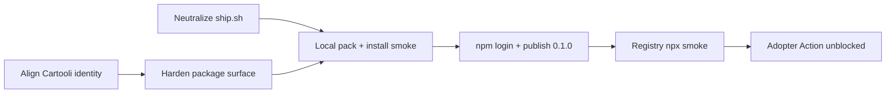

# feat: Publish sunshine-bot to npm and align GitHub identity

## Goal Capsule

Make `sunshine-bot` publicly installable via `npx sunshine-bot` / `npx sunshine-bot@latest`, and make every in-scope identity surface (package metadata, license, README, generated markdown header, this repo’s `SUNSHINE.md`) match the real GitHub home `Cartooli/sunshine-bot`.

**Done when:** `npm view sunshine-bot version` returns `0.1.0`, `npx --yes sunshine-bot@latest --version` works from a clean cache, and no in-scope identity surface still advertises `dwellchecker` (repo URL or copyright holder).

**Stop if:** the unscoped name is taken before publish, or the publisher cannot authenticate to npm with 2FA.

---

## Product Contract

### Summary

Ship the first public npm release of the existing v0.1.0 CLI and align branding with the live public repo. No product-feature work.

Product Contract preservation: N/A (ce-plan-bootstrap; no upstream brainstorm).

### Requirements

- R1. The package name `sunshine-bot` version `0.1.0` is published publicly on the npm registry.
- R2. `npx sunshine-bot` and `npx --yes sunshine-bot@latest run` resolve and execute the CLI (matches `.github/workflows/sunshine.yml`).
- R3. Public identity strings that ship in the npm tarball or affect new consumer `SUNSHINE.md` files point at `https://github.com/Cartooli/sunshine-bot`.
- R4. Destructive / stale GitHub bootstrap tooling is neutralized so “ship” cannot recreate the wrong org or wipe `.git`.
- R5. Pre- and post-publish verification prove tarball contents and registry install without relying on local `node_modules`.

### Actors

- A1. Maintainer — owns npm login/2FA and performs the first `npm publish`.
- A2. Adopter — installs via `npx` or copies the GitHub Action template.

### Key Flows

- F1. Identity alignment + neutralize `ship.sh` (can parallel) → package surface harden → local pack/smoke → manual publish → registry smoke.
- F2. Adopter Action: checkout → `npx --yes sunshine-bot@latest run` → commit `SUNSHINE.md` (unblocked by R1/R2).

### Acceptance Examples

- AE1. From a temp directory with cleared npx cache: `npx --yes sunshine-bot@latest --version` prints `0.1.0`.
- AE2. Fresh `SUNSHINE.md` created by the markdown channel links to `Cartooli/sunshine-bot`, not `dwellchecker`.
- AE3. `npm pack --dry-run` lists `bin/`, `src/`, `sunshine.config.example.json`, `README.md`, `LICENSE` and does not include secrets or `ship.sh`.

### Scope Boundaries

**In scope**
- Metadata/branding fixes for the canonical Cartooli home
- Package publish surface (`bin`, executable bit, optional homepage/bugs)
- Neutralizing `ship.sh`
- Manual first publish of `0.1.0` and smoke verification

**Out of scope**
- New praise-engine/channel features
- Marketing launch campaign execution
- Slack webhook / ops setup for adopters
- GitHub Release + changelog ceremony (deferred)
- Trusted-publishing CI for later versions (deferred after first publish)

### Deferred to Follow-Up Work

- GitHub Release / changelog for `0.1.0`
- npm Trusted Publishing (OIDC) workflow for `0.1.1+` (requires package to exist first)
- Regenerating `assets/og-image.png` / SVG / Slack example URLs (marketing polish; not in npm tarball)
- CI workflow that runs `npm test` on PRs

---

## Planning Contract

### Assumptions

- Canonical GitHub home stays `Cartooli/sunshine-bot` (live public remote); docs currently claiming `dwellchecker` are wrong, not aspirational for this ship.
- Publish unscoped `sunshine-bot` under the maintainer’s npm account (user must `npm login` with 2FA).
- First publish is `0.1.0` only; no Release/changelog gate.
- Copyright holder string updates from `dwellchecker` to `Cartooli` for LICENSE/README consistency with the org that owns the repo.

### Key Technical Decisions

- KTD1. Manual first publish with account 2FA; defer OIDC trusted publishing until after `0.1.0` exists. (npm trusted publisher cannot attach to a package that does not exist yet.)
- KTD2. Add a second `bin` key `sunshine-bot` → same file as `sunshine`, so global installs and docs that type the package name both work; sole-bin already makes `npx sunshine-bot` work.
- KTD3. Set executable bit on `bin/sunshine.js` before pack so POSIX installs do not hit permission errors.
- KTD4. Neutralize `ship.sh` (delete or replace with a short “do not run / already shipped” stub) rather than retargeting it — it `rm -rf .git` and defaults to the wrong org.
- KTD5. Fix the markdown channel `HEADER` URL in `src/channels/markdown.js` as a required identity fix — it ships in the tarball and seeds adopters’ new logs.

### High-Level Technical Design

### Risks & Dependencies

| Risk | Mitigation |
|---|---|
| Name collision before publish | Re-check `npm view sunshine-bot` immediately before publish |
| Maintainer not logged into npm | Explicit handoff: code changes can land without publish; R1 needs A1 |
| Wrong org still in runtime HEADER | Cover AE2 with a unit/integration assertion on HEADER or fresh-file deliver |
| Someone runs stale `ship.sh` | Delete or stub before advertising “ship” |

### Alternatives Considered

- **Scoped `@cartooli/sunshine-bot`** — safer namespace ownership, but breaks documented `npx sunshine-bot` and Action template; rejected for this ship.
- **Move repo under `dwellchecker`** — higher coordination cost; live home is already Cartooli; rejected.
- **Block first publish on OIDC CI** — impossible until package exists; rejected.

---

## Implementation Units

### U1. Align public identity to Cartooli

**Goal:** Every identity string that ships or seeds consumer docs points at `Cartooli/sunshine-bot`.

**Requirements:** R3, AE2

**Dependencies:** none

**Files:**
- `package.json` (modify — `repository.url`; optional `homepage` / `bugs`)
- `LICENSE` (modify)
- `README.md` (modify — footer copyright)
- `src/channels/markdown.js` (modify — `HEADER` link)
- `SUNSHINE.md` (modify — intro link for this repo’s log)
- `test/render.test.js` or `test/index.test.js` (modify — assert Cartooli URL in fresh markdown HEADER path)

**Approach:**
1. Replace `dwellchecker/sunshine-bot` with `Cartooli/sunshine-bot` in package metadata, LICENSE copyright holder, README footer, markdown `HEADER`, and this repo’s `SUNSHINE.md` intro.
2. Add a focused test that a newly created markdown log (or exported HEADER content) contains the Cartooli URL and not dwellchecker.
3. Leave marketing assets (`assets/*`) for follow-up unless trivial text-only edits are desired in-pass.

**Patterns to follow:** Existing markdown channel deliverer and `test/index.test.js` markdown write coverage.

**Test scenarios:**
- Happy path: delivering markdown into an empty cwd creates a file whose header links to `https://github.com/Cartooli/sunshine-bot`.
- Regression: header/body must not contain `dwellchecker/sunshine-bot`.
- Existing-file path with marker: identity change does not break marker prepend behavior (existing tests remain green).

**Verification:** `npm test` green; identity grep shows no `dwellchecker` leftover in `package.json`, `LICENSE`, `README.md`, `src/`, or `SUNSHINE.md`.

---

### U2. Harden npm package surface

**Goal:** Tarball is installable as a CLI with unambiguous bin names and correct modes.

**Requirements:** R2, AE3

**Dependencies:** U1

**Files:**
- `package.json` (modify — `bin` alias; optional `publishConfig`)
- `bin/sunshine.js` (modify mode — ensure executable bit)

**Approach:**
1. Add `"sunshine-bot": "bin/sunshine.js"` alongside existing `"sunshine"`.
2. `chmod +x bin/sunshine.js` and ensure git tracks the executable bit.
3. Do not add runtime dependencies.

**Patterns to follow:** Current ESM shebang `#!/usr/bin/env node` in `bin/sunshine.js`; keep `"files"` allowlist as-is.

**Test scenarios:**
- Test expectation: none for pure metadata/mode — rely on pack/install smoke in Verification Contract.
- Optional: if a test helper already reads `package.json` bin map, assert both keys point at the same path.

**Verification:** `npm pack --dry-run` includes `bin/sunshine.js`; local install from tarball exposes both `sunshine` and `sunshine-bot` shims.

**Execution note:** Prefer install/runtime smoke over unit coverage for bin/mode.

---

### U3. Neutralize stale GitHub bootstrap script

**Goal:** `ship.sh` cannot recreate the wrong org or destroy local git history.

**Requirements:** R4

**Dependencies:** none (can parallel U1)

**Files:**
- `ship.sh` (delete or replace with a non-destructive stub that prints the Cartooli URL and exits non-zero if someone expects the old behavior)

**Approach:**
1. Prefer deletion if nothing references it; otherwise replace body with a short message: repo already lives at Cartooli; use npm publish path instead.
2. Update any README mention of `ship.sh` if present (today README does not document it).

**Test scenarios:**
- Test expectation: none -- operational safety / docs cleanup.

**Verification:** Running `bash ship.sh` either fails immediately with a clear message or the file is gone; no `rm -rf .git` remains in tree.

---

### U4. First publish and registry smoke

**Goal:** `0.1.0` is live and the Action/docs install path works.

**Requirements:** R1, R2, R5, AE1, AE3

**Dependencies:** U1, U2, U3

**Files:** none required (operational unit); may touch nothing if U1–U3 already landed.

**Approach:**
1. Re-check name free: `npm view sunshine-bot` → 404.
2. Gate: `npm test`, then `npm pack --dry-run` / `npm publish --dry-run`.
3. Maintainer: `npm login` (2FA), then `npm publish` of `0.1.0`.
4. Post-publish: `npm view sunshine-bot version`; from a clean dir, `npx --yes sunshine-bot@latest --version` and a dry `preview` against a throwaway git repo if useful.
5. Record follow-up: configure Trusted Publisher on the new package for later releases.

**Patterns to follow:** Consumer contract in `.github/workflows/sunshine.yml` (`npx --yes sunshine-bot@latest run`).

**Test scenarios:**
- Covers AE1: clean-cache `npx --yes sunshine-bot@latest --version` → `0.1.0`.
- Covers AE3: packed tarball file list matches allowlist expectations.
- Failure path: if publish fails for auth/name, stop and do not claim R1 done.

**Verification:** npm package page shows `0.1.0`; Action template command succeeds when run manually with `--dry-run`/`preview` as appropriate.

**Execution note:** This unit requires maintainer credentials; the coding agent prepares U1–U3 and leaves the actual `npm publish` for the human or an explicitly authorized local session.

---

## Verification Contract

- Local gate: `npm test` (46 tests expected to stay green; +HEADER identity coverage).
- Pack gate: `npm pack --dry-run` (or `npm publish --dry-run`) before publish.
- Install smoke: install from local tarball; run `sunshine-bot --version` and `sunshine --version`.
- Registry smoke (after publish): `npm view sunshine-bot version`; `npx --yes sunshine-bot@latest --version`.
- Identity grep: no `dwellchecker` leftover in `package.json`, `LICENSE`, `README.md`, `src/`, `SUNSHINE.md` (covers wrong repo URL and copyright holder).

## Definition of Done

- U1–U3 merged (or committed) on `main` with tests green.
- U4 complete: `sunshine-bot@0.1.0` public; AE1–AE3 satisfied.
- Deferred items (Release, OIDC, OG assets, PR CI) explicitly left for follow-up, not half-started.

---

## Sources & Research

- Local: `package.json`, `bin/sunshine.js`, `src/channels/markdown.js`, `.github/workflows/sunshine.yml`, `ship.sh`, live remote `Cartooli/sunshine-bot` (public).
- External (load-bearing): npm `npm exec`/`npx` bin resolution rules; trusted publishing requires an existing package — first publish must be manual with 2FA; ESM CLI shebang + `files` allowlist + executable bit pitfalls.
- Name check (planning time): `sunshine-bot` and `@dwellchecker/sunshine-bot` both 404 on registry.
- No institutional learnings under `docs/solutions/` (absent).
